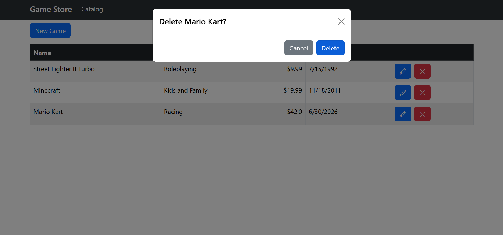

# Video-Game-Store-Pro-Backend (.NET 8)

Building a ASP.NET Core (.NET 8) web application backend for a video game store in VS code.

The frontend of this project can be found [here](https://github.com/ting11222001/Video-Game-Store-Pro-NET-8-Frontend).

This is a more polished version of this project: [here](https://github.com/ting11222001/Video-Game-Store).

## Table of Contents

- [Demo](#demo)
- [Getting Started](#getting-started)
- [Key Concepts](#key-concepts)

## Demo

### Get All Games
Retrieves the full list of games from the store.


### Update Game
Updates the details of an existing game.


### Delete Game
Removes a game from the store.



## Getting Started

Clone the repo.

Check if the .NET SDK is installed:

```bash
dotnet --list-sdks
```

### Backend

To build the backend .NET project:

```bash
cd Backend/src/GameStore.Api
dotnet build
```

Then, run up the backend:

```bash
cd Backend/src/GameStore.Api
dotnet run
```

### Frontend

To build the frontend .NET project:

```bash
cd src/GameStore.Frontend
dotnet build
```

Then, run up frontend:

```bash
cd src/GameStore.Frontend
dotnet run
```

## Key Concepts

- REST API Design
- Data Transfer Objects (DTOs)
- CRUD endpoints
- extension methods
- route groups
- Handling invalid inputs
- Entity Framework Core
- Defining the data model
- Using the ASP.NET Core configuration system
- Generating the database and seeding data
- Understanding dependency injection and service lifetimes
- Saving new entities to the database
- Mapping entities to DTOs
- Querying, updating, and deleting entities from the database
- Using the asynchronous programming model
- API integration with the frontend
